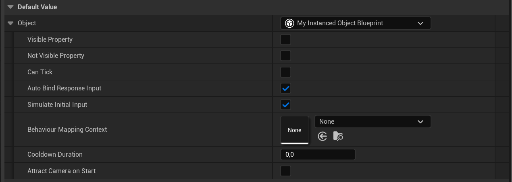
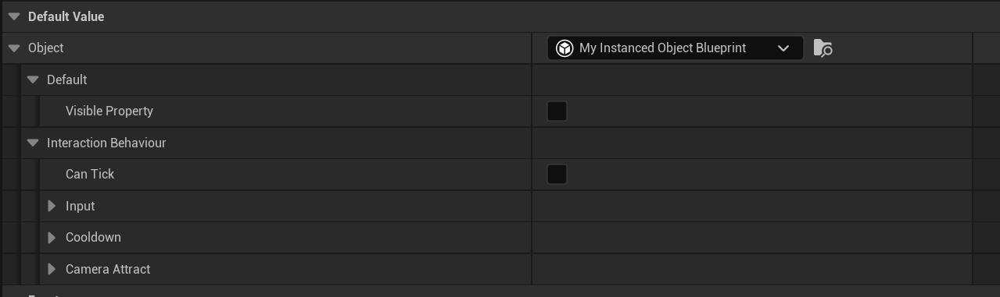

# Instanced Object Details

An Unreal Engine editor plugin that improves the Details panel experience for instanced (`EditInlineNew`) UObject properties.

Out of the box, UE dumps **every** property from a Blueprint-derived instanced object into a flat, unorganized list — including internal properties you never want to edit on instances. This plugin fixes that.

## Features

- **Property filtering** — automatically hides properties marked as `DisableEditOnInstance`, showing only what's actually relevant
- **Category grouping** — respects `Category` metadata (including `|`-delimited subcategories) and renders them as collapsible groups
- **Browse to Blueprint** — adds a button next to the class picker that navigates the Content Browser to the source Blueprint asset (only visible for BP-generated classes)
- **Zero-config** — drop the plugin into your project and it works immediately for all `Instanced` UObject properties. No setup, no base class changes, no boilerplate

## Before / After

| Before | After |
|--------|-------|
|  |  |

> *Properties are filtered by editability flags, and grouped into collapsible categories.*

<!-- 
    Replace placeholder images:
    1. Create a Docs/ folder in the repo root
    2. Add before.png and after.png screenshots
    
    Recommended: capture the same instanced object in the Details panel
    with the plugin disabled vs enabled.
-->

## Installation

1. Clone or download this repository into your project's `Plugins/` directory:
   ```
   YourProject/
   └── Plugins/
       └── InstancedObjectDetails/
           ├── InstancedObjectDetails.uplugin
           └── Source/
   ```
2. Regenerate project files and build.
3. That's it — the plugin loads automatically at `PostEngineInit`.

## How It Works

The plugin registers a custom `IPropertyTypeCustomization` with a targeted `IPropertyTypeIdentifier` that only matches `FObjectPropertyBase` properties carrying the `CPF_InstancedReference` flag. This means it won't interfere with regular object references — only instanced (inline-editable) ones.

**Property filtering** — each child property is checked for `CPF_Edit` and rejected if it has `CPF_DisableEditOnInstance`, which filters out properties that are only meant to be edited on the CDO.

**Category tree** — the `Category` meta string (e.g. `"Combat|Damage"`) is parsed into segments and built into a tree of `IDetailGroup` nodes, preserving declaration order within each level.

**Browse button** — when the current value is a `UBlueprintGeneratedClass`, a small content-browser icon appears next to the class picker. Clicking it calls `SyncBrowserToAssets` on the originating Blueprint.

## Compatibility

- **Engine**: UE 5.x (tested on 5.4–5.6, [released](https://github.com/PsinaDev/ue-instanced-object-details/releases/tag/5.6) on 5.6)
- **Module type**: Editor only — zero runtime overhead, not compiled into shipping builds

## License

MIT — see [LICENSE](LICENSE) for details.
